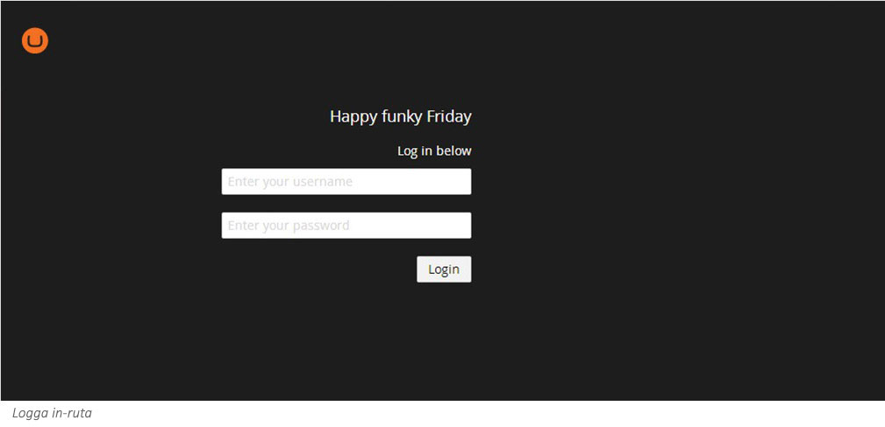
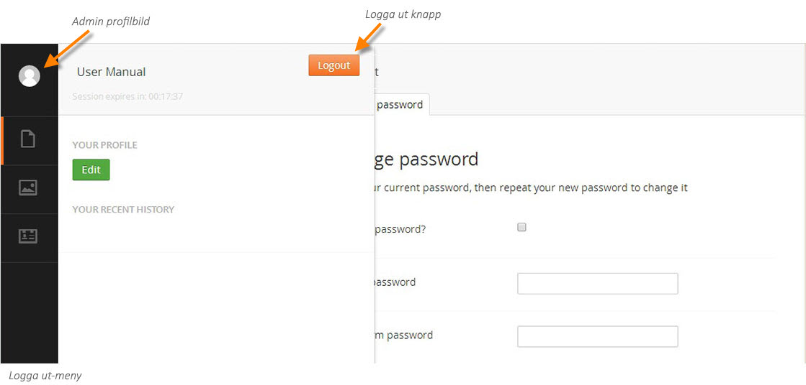

###1. Logga in och ut###

**Logga in**

För att komma åt Umbraco öppnar du din webbläsare och skriver in adressen till din webbplats följt av
/umbraco/ (till exempel: http://www.foretaget.se/umbraco/) Här möts du av en inloggningsruta där du fyller i
det användarnamn och lösenord som du har blivit tilldelad.

**Logga ut**

För att logga ut från admin-delen klicka på profilbilden högst upp till vänster på skärmen. I den meny som
fälls ut klickar du på knappen **Log out** (Logga ut) längst till höger i menyn.

