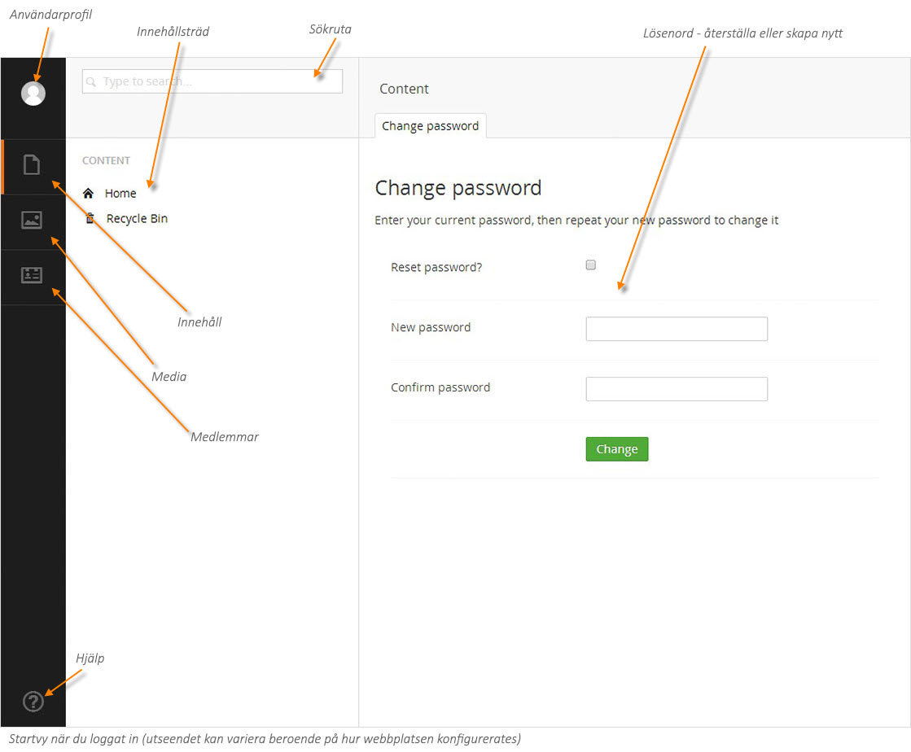
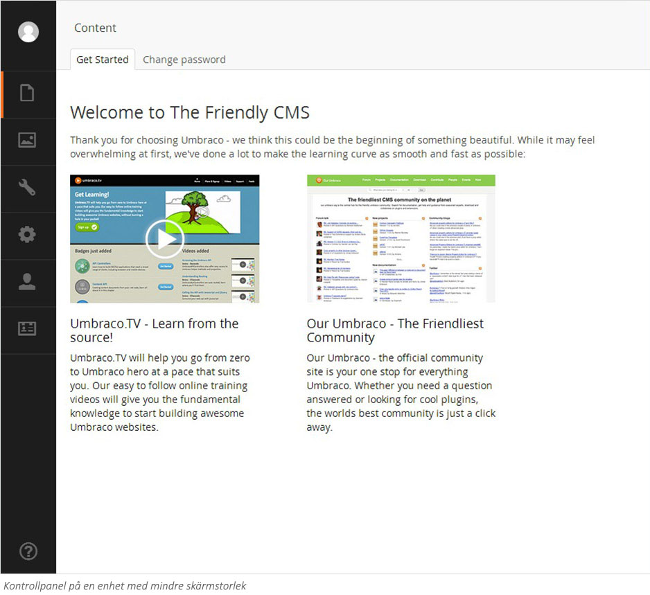
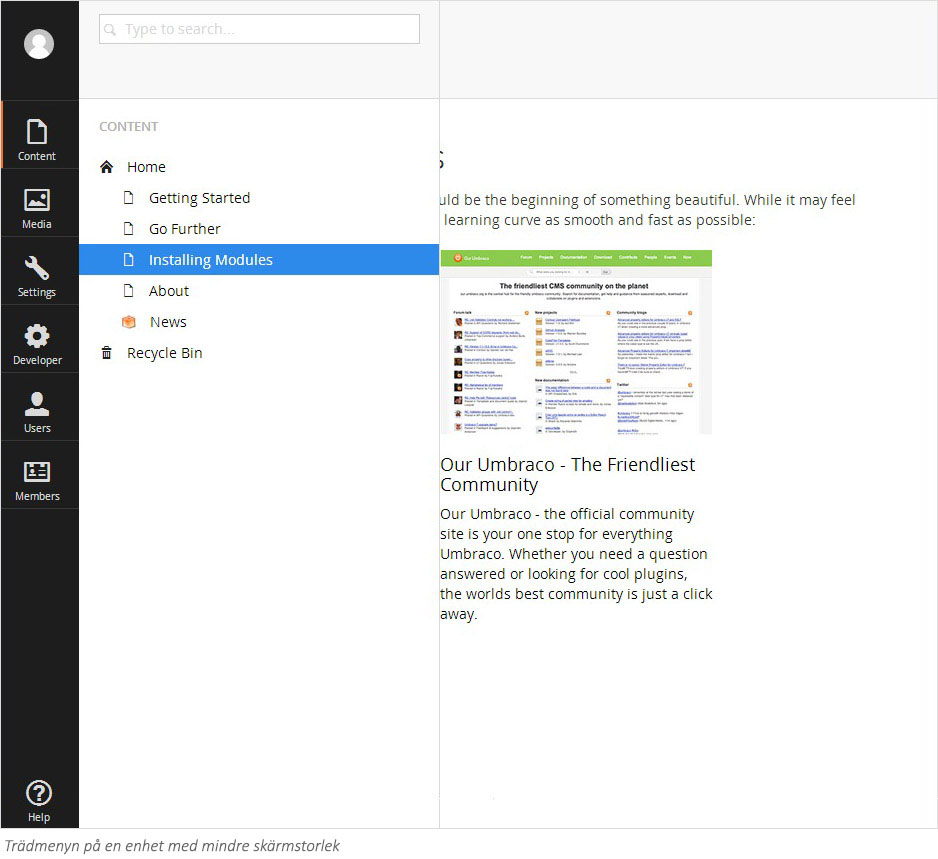

###2. Umbraco gränssnitt###

####2.1 Startvy####

När du har loggat in kommer du in i Umbracos innehållsdel (Content). Det finns flera sektioner inom
Umbraco som låter dig administrera olika delar av din webbplats. I Content jobbar du med själva innehållet
på webbsidorna. Vilka övriga sektioner du har tillgång till kan variera bereonde på vilken roll du har som
användare. En redaktör har vanligen bara tillgång till Content och Media. I Media samlas de bilder, filer och
dokument som används på webbplatsen. Du navigerar mellan de olika sektionerna genom att klicka på de
olika ikonerna i den svarta menyraden längst ute till vänster.

Till höger om menyraden finns ett träd som visar strukturen på din webbplats. För att navigera i trädet klickar
du på de svarta pilarna till vänster om de olika objekten vilket visar eventuella undersidor. Klickar du på ett
sidnamn dyker innehållet på den sidan upp på den stora innehållsytan till höger om trädvyn.

####2.2 Utseende vid mindre skärmstorlekar####

Som default, på en dator med hög skärmupplösning, är trädyn alltid synlig så att du snabbt och enkelt kan
navigera bland innehållet på webbplatsen. På enheter med mindre skärmar som bärbara datorer eller plattor
är trädvyn stängd och öppnas först när du klickar på någon av ikonerna i den svarta menyraden längst till
vänster.

När du har valt en sektion i trädvyn på en mindre enhet, så stängs den sedan automatiskt för att ge plats
åt sidinnehållet. Om du vill stänga trädvyn utan att välja en sida kan du flytta muspekaren bort från trädvyn
eller alternativt på en enhet med touchfunktion kan du swajpa vänster över trädvyn. Nedan ser du exempel
på hur gränssnittet ser ut på en platta.

