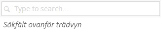

###4. Hitta innehåll###

Innehållsträdet i Umbraco gör det möjligt för dig att navigera dig genom webbsidorna via en logiskt uppbyggd sajtstruktur och hitta fram till rätt sida - om du vet var i strukturen den hör hemma. Ett snabbare sätt att hitta rätt sida kan vara genom att använda sökverktyget högst upp i trädvyn. När du anger ett sökord kommer Umbraco att leta rätt på sidor som innehåller det sökordet, antingen i sidtitel eller i innehållet på sidan.

