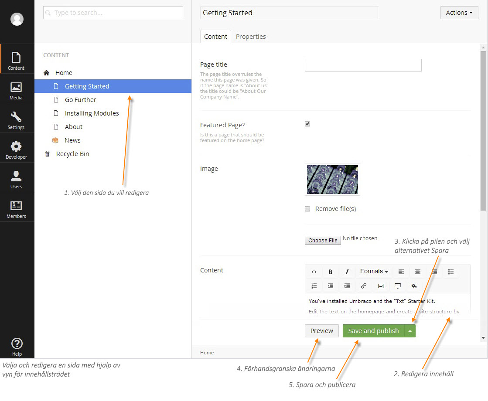
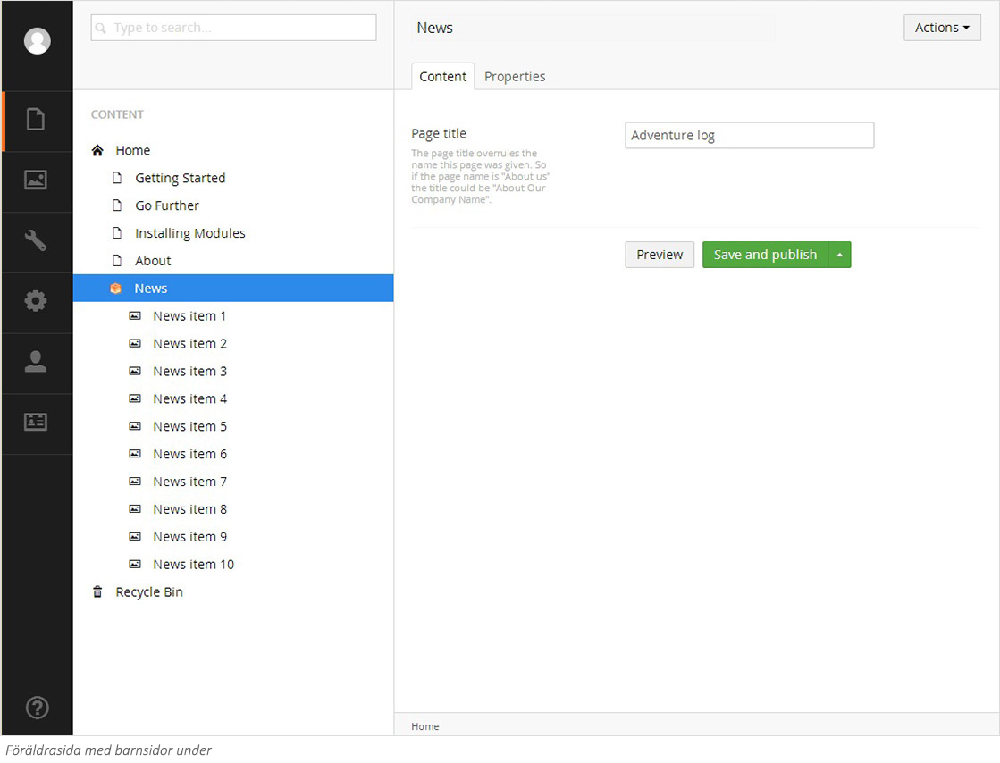
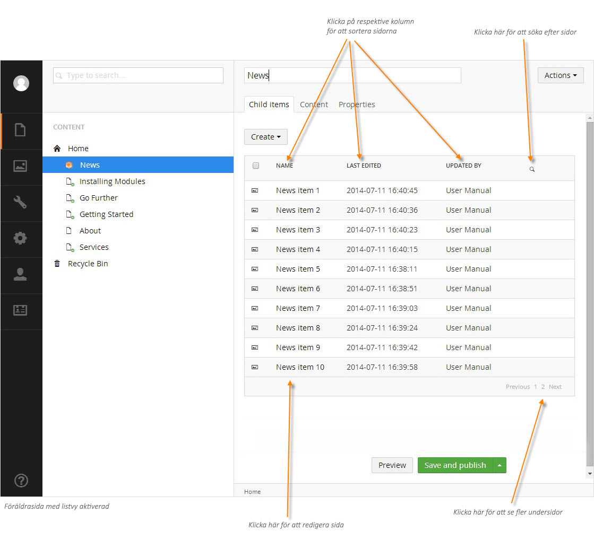

###5. Redigera befintligt innehåll###

####5.1 Innehåll i trädstrukturen####

När du vill redigera innehåll på en befintlig sida kan du följa dessa steg:

1. Hitta och välj den sida du vill redigera.
2. Redigera sidinnehållet på innehållsytan. Varje sidtyp ar olika fält för dig att fylla i - textrutor, innehållsväljare, datumväljare, texteditor etc. Se avsnitt 3 för mer information om att arbeta med innehåll.
3. Klicka på pilen intill **Save and publish** (Spara och publicera) för att se alternativ. Välj Spara i menyn.
4. Klicka på **Preview** (Förhandsgranska) för att förhandsgranska hur sidan kommer att se ut när den publicerats på webbplatsen.
5. Om du är nöjd med ändringarna klicka på **Save and publish** (Spara och publicera) för att publicera på webbplatsen.

####5.2 Lista sidor i vy

Vissa sidor på webbplatsen kan använda en vy för att lista sidor, vilket visar alla barn i ett tabellformat istället för i trädstrukturen.

Skärmbilden nedan visar tio barn under föräldern News i trädstrukturen. Om en sida på webbplatsen har många barn, upp emot hundra barn är inte ovanligt, så blir trädstrukturen väldigt lång och svår att hantera. 

Nästa skärmbild visar hur listvyn fungerar. Notera i trädstrukturen till vänster att inga barn syns under News, utan sidorna listas istället i en tabell till höger.

Tabellen visar max tio sidor åt gången. Finns det fler sidor så kan du bläddra dig framåt via pagineringen längst ned till höger. Längst upp till höger finns en sökknapp där du kan leta rätt på specifika sidor utan att använda pagineringen. Du kan klicka på kolumnrubrikerna för att sortera listan. Till exempel, klicka på kolumnen **Name** (Namn) så sorteras listan alfabetiskt.

