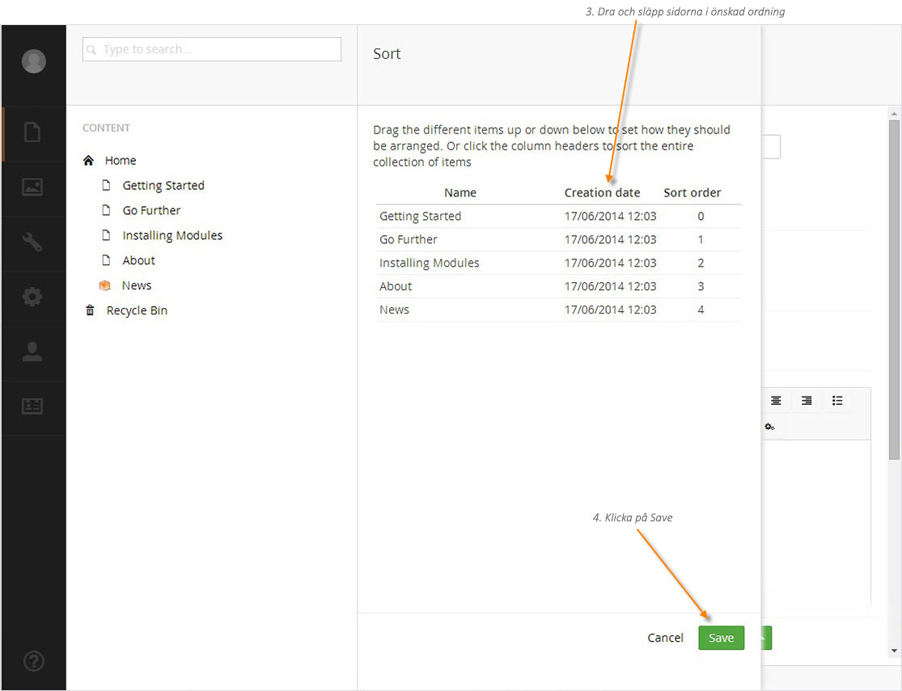

###6. Sortera sidor###

Sidorna i Umbraco är sorterade i trädstrukturen på ett fördefinierat sätt. Vanligtvis hamnar den senast skapade sidan längst ned i trädstrukturen. Du kan lätt ändra sorteringsordningen genom att använda sorteringsfunktionen. 

1. Välj föräldrasidan till den undersida du vill ändra ordning på.
2. Högerklicka på ikonen **(•••)** och välj **Sort** (Sortera) från menyn som fälls ut. 
1. Klicka och dra sidorna i önskad ordning. Alternativt, klicka på kolumnrubrikerna **Name** (Namn) eller **Creation date** (Datum då sidan skapades) för att sortera enligt rubrik. Klickar du på kolumnrubriken en gång till så omvänds sorteringsordningen.
2. Klicka på **Save** (Spara).

