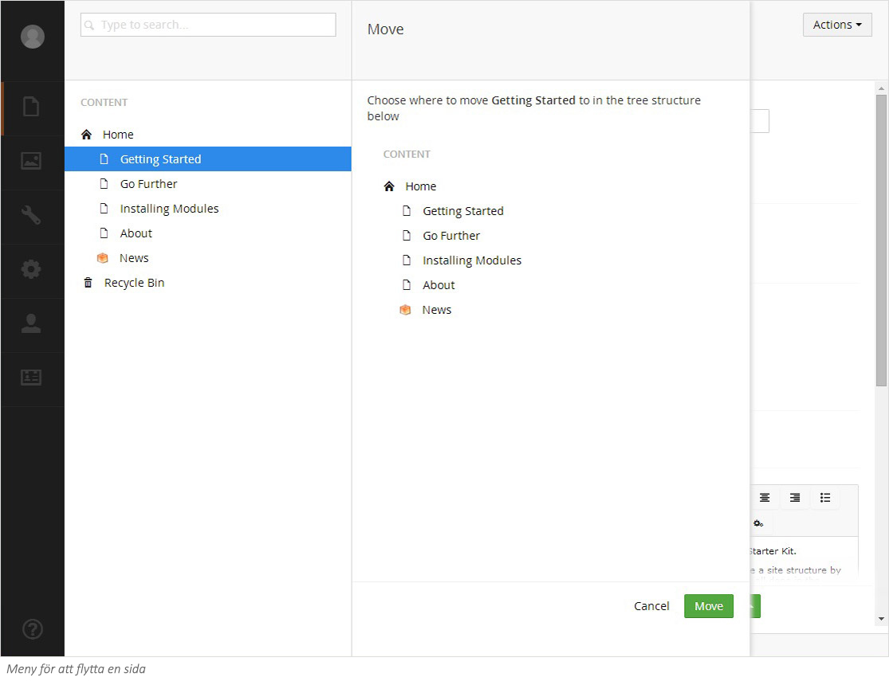

###8. Kopiera en sida###

Om du vill återanvända en sida eller struktur som du tidigare skapat kan du kopiera sidan och dess undersidor
till en annan plats i strukturen. När du kopierar en sida kommer även alla undersidor att kopieras. Du kan
definiera om länkar ska uppdateras automatiskt eller om du vill behålla den ursprungliga länkningen till
originalsidorna.

1. Högerklicka på den sida du vill flytta för att fälla ut menyn. Alternativt klicka på **Actions** (Händelser) högst
upp till till höger på sidan.
2. Klicka på **Copy** (Kopiera) och välj i trädet den föräldrasida dit du vill kopiera sidan.
1. Välj om du vill **Relate copied items to the original page.*** (Relatera länkar till originalsidan)
2. Klicka på knappen **Copy** (Kopiera) för att bekräfta flytten.

** När du väljer “Relate copied items to the original page” så kommer varje ändring du gör på den kopierade sidan
också att göras på originalsidan. Så om du vill ha originalsidan och den kopierade sidan separerade från varandra
bocka inte för rutan “Relate copied items to the original page”.*

