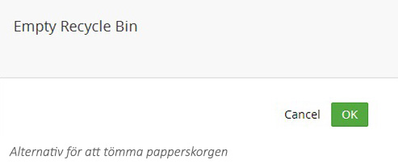

###9. Radera och återställa sidor###

####9.1 Radera sida####

Om du har sidor du inte längre vill ha kvar på webbplatsen kan du radera dem. När du raderar flyttas sidan
till **Recycle bin** (Papperskorgen) som en säkerhetsåtgärd om du ändrar dig och vill återställa sidan.

1. Leta upp den sida du vill radera i trädstrukturen.
2. Högerklicka på den sida du vill flytta för att fälla ut menyn, alternativt klicka på **Actions** (Händelser)
högst upp till till höger på sidan.
1. Klicka på **Delete** (Radera).
2. Klicka på **OK** för att bekräfta att du vill radera eller klicka på **Cancel** om du inte vill radera.

####9.2 Återställa en raderad sida från papperskorgen

Papperskorgen är en separat trädstruktur längst ned i innehållsträdet. Om du klickar på pilen till vänster om
ikonen för papperskorgen kan du se alla sidor som har raderats från webbplatsen. Att återställa dessa sidor
följer samma steg som att flytta en sida mellan olika avdelningar.

1. Klicka på ikonen **(•••)** på den sida du önskar återställa från papperskorgen för att fälla ut menyn.
2. Klicka på **Move** (Flytta) och välj den föräldrasida där du vill att sidan ska hamna.
1. Klicka på knappen **Move** (Flytta) för att bekräfta flytten.
2. Klicka **OK** för att bekräfta.
1. Nu behöver du gå till sidan och återpublicera den genom att klicka på **Save and publish** (Spara och
publicera) för att den ska bli synlig på webbplatsen.

####9.3 Tömma papperskorgen####
Om du är säker på att du inte längre behöver något innehåll i papperskorgen kan du radera det permanent.
Du kan radera enstaka sidor eller allt i papperskorgen. Observera att om du raderar sidor från papperskorgen
kommer du inte att kunna nå något data associerat med den sidan.

**Tömma papperskorgen**

1. Klicka på ikonen **(•••)** på papperskorgen för att fälla ut menyn.
2. Klicka på **Empty Recycle Bin** (Töm papperskorgen).
3. Klicka **OK** för att bekräfta att du vill tömma papperskorgen eller **Cancel** om du inte vill göra det.

**Radera enstaka sidor**

1. Klicka på ikonen **(•••)** på den sida du vill permanent radera för att fälla ut menyn.
2. Klicka **Delete** (Radera).
1. Klicka **OK** för att bekräfta att du vill radera sidan permanent eller **Cancel** om du inte vill göra det.