###1. Textredigeraren###
Med Umbracos textredigerare kan du som redaktör vara kreativ. Du kan arbeta med textinnehåll, formatera
text, lägga in bilder, skapa tabeller och länka till andra sidor eller filer.

Funktionaliteten varierar bereonde på hur textredigeraren är konfigurerad. Här beskriver vi
redigeringsverktyget med alla funktioner aktiverade. Kontakta din systemadministratör för frågor som rör din
textredigerare.

####1.1 Knappar i textredigeraren####
Nedan ser du alla tillgängliga standardknappar. Din systemadministratör kan bestämma vilka knappar som
är tillgängliga för olika mallar och sidtyper. Det är därför möjligt att du har tillgång till fler eller färre knappar
än de som visas nedan.

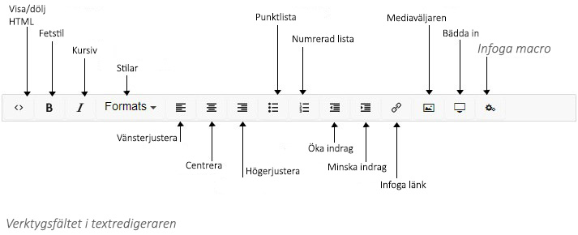

####1.2 Nytt stycke/radbrytning####
Textredigeraren är som vilket annat ordbehandlingsprogram. Du skriver text och texten radbryter
automatiskt. När du trycker ENTER får du ett nytt stycke vilket innebär ett avstånd ner till nästa stycke. Om
du inte vill ha ett nytt stycke utan en radbrytning så trycker du SHIFT + ENTER.

####1.3 Kortkommandon####
För att underlätta ditt arbete så finns det kortkommandon för vissa funktioner i editorn. Med
kortkommandon kan du utföra vissa åtgärder genom att använda tangentbordet.

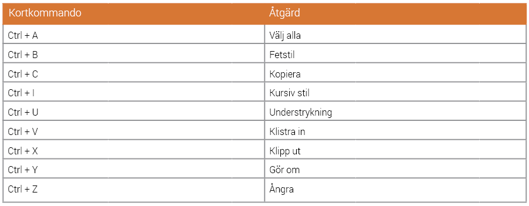

####1.4 Formatera text####
Du behöver inte lägga ned så mycket tid på att formatera text eftersom Umbraco tar hand om det mesta av
formateringen. Men det finns ett antal funktioner du kan använda dig av för att påverka hur texten ser ut.

**Formatknappar**

Det grundläggande och mest välbekanta sättet att formatera är via knappar i verktygsfältet. Detfungerar på
ungefär samma sätt som i Word eller andra ordbehandlingsprogram. Du kan välja att exempelvis göra texten
fet, kursiv, understruken eller skapa listor.

Vilket du än vill utföra så gör du det enligt följande steg:

1. Markera den text du vill formatera.
2. Klicka på önskad knapp i verktygsfältet för att lägga på önskad formatering.

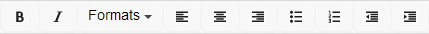

**Stilar**

Ett annat sätt att formatera är att använda sig av **Formats** (Stilar). Under pilen intill **Formats** i verktygsfältet
döljer sig ett antal fördefinierade stilar som du kan applicera på din text. De här stilarna går hand i hand med
din grafiska profil vad gäller rubrikstorlekar och annat. I den här menyn hittar du de olika rubrikstorlekar som
du använder på sidan. Exakt vilken typ av formatering du kan göra, och på vilka delar av innehållet, varierar
från webbplats till webbplats. Kontakta din systemadministratör om du har några frågor.

För att lägga på en stil följer du alltid samma steg:

1. Markera den text du vill formatera.
2. Välj önskad stil från menyn **Formats**.

**Kopiera innehåll från andra program**

Det är viktigt att tänka på att om du kopierar text från word eller andra program och sedan kopierar in texten
i Umbracos textredigerare så kan det uppstå problem. När du klistrar in text följer ofta originalformateringen
med vilket kan leda till annat utseende på teckensnitt, storlek eller färg, än övriga delar på webbplatsen. För
att förhindra detta kan det vara bra att först klistra in texten i Anteckningar, och därifrån kopiera och klistra
in i textredigeraren.

Du kan också välja att klistra in texten utan formatering. Det gör du genom att högerklicka i textredigeraren
och välja alternativet **“Klistra in som oformaterad text”** (Shift+Ctrl+V).

**Ta bort formatering**

Om du har formaterat ett stycke eller en del på sidan genom att använda knapparna i verktygsfältet så
kan du ta bort formateringen genom att markera texten och klicka på aktuell knapp i verktygsfältet. Ibland
finns en knapp för att ta bort formatering i verktygsfältet. Om du inte har den knappen, kontakta din
systemadministratör.

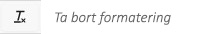

####1.5 Visa/dölj HTML-kod####

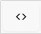
Om du är bekant med HTML kan du växla över till HTML-läge och skapa ditt sidinnehåll den
vägen. Du kan också kontrollera koden och göra mindre förändringar. Allt går dock inte att göra.
Du kan inte lägga till scripts eller annan kod som kan skada sidinnehållet. Kontakta din
systemadministratör om du är osäker.

####1.6 Länkar####
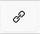

Knappen **Infoga länk** används för att skapa länkar till interna och externa sidor eller filer,
e-postlänkar eller bokmärken. Exakt hur du går till väga varierar en del bereonde på vilken typ
av länk du vill skapa.

**Länk till sida på en annan webbplats**

1. Markera den text som ska bli länkad
2. Klicka på knappen **Insert link** (Infoga länk) för att fälla ut egenskaperna för länken.
3. I fältet URL, fyll i adressen till den webbsida du vill länka till.
4. I fältet **Page Title** (Sidtitel) fyll i den text som ska visas som länkbeskrivning. Det här är viktigt för
tillgängligheten på webbplatsen.
5. I fältet **Target** (Mål) väljer du på vilket sätt länken ska öppnas. Det finns tre olika alternativ:
  1. Öppna länk i samma browserfönster.
  2. Öppna länk i nytt browserfönster.
  3. Öppna länk i det nuvarande browserfönstret.
6. Klicka på **Select** (Välj). Din text innehåller nu den angivna länken.

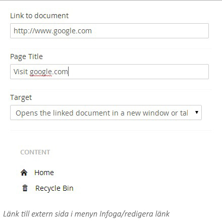

**Länka till en sida i Umbraco**
1. Markera den text som ska bli länkad. 
2. Klicka på knappen **Insert link** (Infoga länk) för att fälla ut egenskaperna för länken.
3. Välj den sida du vill länka till från trädet **Content** (Innehåll) för att automatiskt lägga till länken i rutan **Link to document** (Länk till dokument).
4. I fältet **Page Title** (Sidtitel) fyll i den text som ska visas som länkbeskrivning. Det här är viktigt för tillgängligheten på webbplatsen.
5. I fältet **Target** (Mål) anger du i vilket fönster/ram som länken ska öppnas i.
6. Klicka **Select** (Välj).

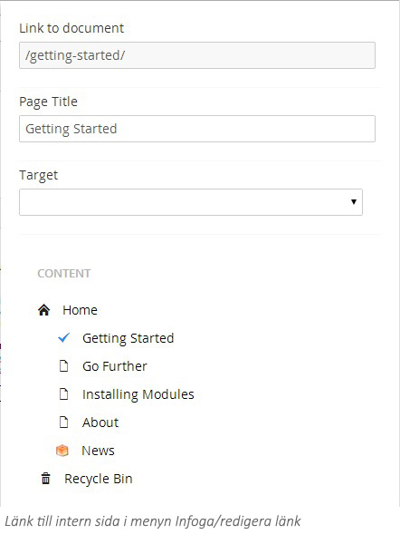

**Länka till en Mediafil i Umbraco**
1. Markera den text som ska bli länkad. 
2. Klicka på knappen **Insert link** (Infoga länk) för att fälla ut egenskaperna för länken. 
3. Välj knappen **Link to file** (Länk till fil) längst ned i menyn. 
4. Du kommer in i mediaväljaren där du kan välja önskad fil.
5. När du har valt fil kommer du tillbaka till länkmenyn där fälten för **Link to document** (Länk till dokument) och **Page title** (Sidtitel) automatiskt har fyllts i. Du kan förstås ändra sidtitel till ett annat namn om du önskar.
6. I fältet **Target** (Mål) anger du i vilket fönster/ram som länken ska öppnas i. 
7. Klicka **Select** (Välj).

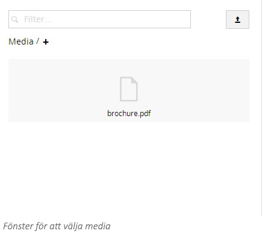

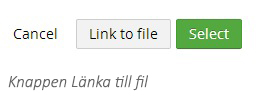

**Länka till en e-postadress i Umbraco**
1. Markera den text som ska bli länkad. 
2. Klicka på knappen **Insert link** (Infoga länk) för att fälla ut egenskaperna för länken. 
3. I fältet URL, fyll i texten mailto: följt av den e-postadress du vill länka till (t.ex. mailto:namn@foretag.se)
4. I fältet **Page Title** (Sidtitel) fyll i den text som ska visas som länkbeskrivning. Det här är viktigt för tillgängligheten på webbplatsen.
5. I fältet **Targe**t (Mål) anger du i vilket fönster/ram som länken ska öppnas i. 
6. Klicka **Select** (Välj).

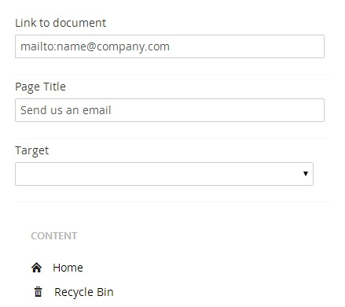

**Länka till ett bokmärke på samma sida**

Ett bokmärke (anchor) gör det möjligt för dig att skapa interna länkar så att besökaren kan navigera inom en sida. Det finns två moment att göra när man skapar ett bokmärke: själva bokmärket och en länk till bokmärket. 

**Skapa ett bokmärke**
1. Ställ markören där du vill skapa ditt bokmärke.
2. Klicka på knappen **Anchor** (Bokmärke) för att öppna dialogrutan.
3. I fältet **Name** (Namn) fyll i namn på bokmärket. Undvik å,ä,ö, specialtecken och mellanslag. 
4. Klicka **OK** för att avsluta.
5. Du kommer att se en liten ankar-ikon där markören tidigare stod. För att radera ett bokmärke markerar du det och klickar på **Delete** (Radera). 

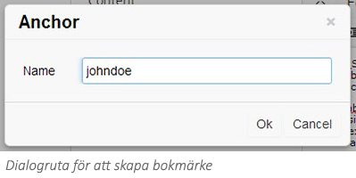

**Länka till ett bokmärke**
1. Markera det innehåll som du vill ange bokmärket till.
2. Klicka på knappen **Insert link** (Infoga länk) vilket fäller ut menyn för länkegenskaper. 
3. Lägg till **#** följt av namnet på ditt bokmärke i fältet **Link to document** (Länk till dokument).
4. Klicka på **Select** (Välj).

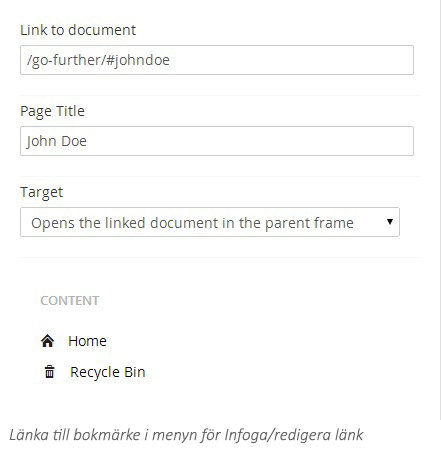

**Länka en bild **

Du kan göra bilder klickbara i Umbraco. 
1. Infoga en bild i editorn (se avsnittet **Arbeta med bilder** för mer detaljer).
2. Markera bilden som ska vara klickbar.
3. Följ samma instruktioner som för att lägga in en vanlig länk, börja med steg 2.

**Ta bort en länk**
1. För att ta bort en länk behöver du först markera den i editorn. För textlänkar räcker det med att klicka in markören någonstans i länken. För bildlänkar klickar du på själva bilden.
2. Klicka på knappen **Remove link** (Ta bort länk) vilket tar bort länken. Om du inte har knappen för att ta bort länk i verktygsfältet kan du också klicka på knappen för att **Infoga/Redigera länk** och manuellt ta bort länken från fältet **Link to document** (Länk till dokument).

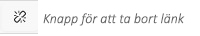

####1.7 Arbeta med bilder####

För att lägga in bilder på en sida måste de först laddas upp till mediabiblioteket i Umbraco. Många företag har förutbestämda bildarkiv och mappar med bilder som redaktörerna får använda sig av. Andra låter redaktörerna själva bygga upp arkivet och ladda upp sina egna bilder. Arbetsmetoderna för att ladda upp och infoga bilder kan därför skilja sig något. Är du osäker på vad som gäller, prata med din systemadministratör.

**Infoga en bild från mediabiblioteket**
1. Ställ markören där du vill ha in din bild.
2. Klicka på knappen **Media Picker** (Välj media) i verktygsfältet för att fälla ut mediamenyn.
3. Välj den mapp som bilden ligger i.
4. Klicka på tumnagelbilden för att öppna dialogrutan med bildegenskaper.
5. I fältet **Title** (Titel) fyller du i ett namn/beskrivning för bilden. Här kommer automatiskt namnet på filen att läggas till om du lämnar det blankt. Det är viktigt att ange beskrivande titlar på bilderna då de används som stöd för tillgänglighet.
6. Klicka på **Insert** (Infoga) för att lägga till bilden.

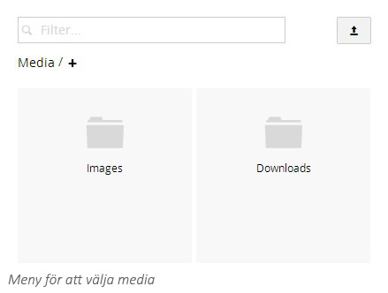
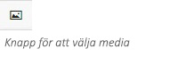

**Infoga en bild från din dator**

Du kan ladda upp bilder från editorn till den sida som du håller på och redigerar. Dessa bilder hamnar i Umbracos mediabibliotek. Var uppmärksam så att bilden placeras på rätt ställe i biblioteket. Om du klickar på den lilla plus-ikonen under sökrutan i mediamenyn kan du skapa undermappar i mediabiblioteket.

1. Placera markören där du vill att bilden ska infogas.
2. Klicka på knappen **Media Picker** (Välj media) i verktygsfältet för att fälla ut mediamenyn. 
3. Klicka på knappen **Upload** (Ladda upp) som ligger längst uppe i högra hörnet.
4. Välj önskad bild i pop-up fönstret.
5. I fältet **Title** (Titel) fyller du i ett namn/beskrivning för bilden. Här kommer automatiskt namnet på filen att läggas till om du lämnar det blankt. Det är viktigt att ange beskrivande titlar på bilderna då de används som stöd för tillgänglighet.
6. Klicka på **Insert** (Infoga) för att lägga till bilden.

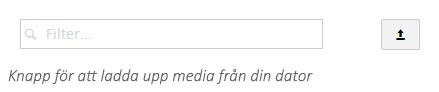

**Ta bort en bild från sidan**

Om du vill radera en bild från sidan, klicka på bilden och på Delete-knappen på ditt tangentbord. Bilden försvinner från sidan, men den är inte raderad från Umbracos mediabibliotek.

####1.8 Makron####
I Umbraco är makron små funktionsblock som kan läggas in i en editor. Varje makro innehåller en viss funktionalitet och är anpassad för din webbplats. Ett makro kan till exempel vara ett kontaktformulär eller en mediaspelare. Fördelarna med makron är att redaktörerna själva på ett enkelt sätt kan lägga in komplexa element på sidan.

Vilka makron som finns tillgängliga för dig varierar från system till system, så kontakta din systemadministratör för att ta del av vilka makron som finns på webbplatsen. Processen för att lägga till och uppdatera makron är alltid densamma. 

**Lägga in ett makro på sidan **

1. Placera markören i textredigeraren där du vill infoga ditt makro. 
2. Klicka på knappen **Insert macro** (Infoga makro) i verktygsfältet för att öppna dialogrutan för makro.
3. Välj ett makro att infoga från listan. 
4. Konfigurera makrot efter behov. 
5. Klicka på **Select** (Välj) för att infoga makro. 
6. Makrot visas i editorn med en gul, prickad ram.

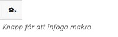
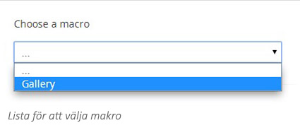

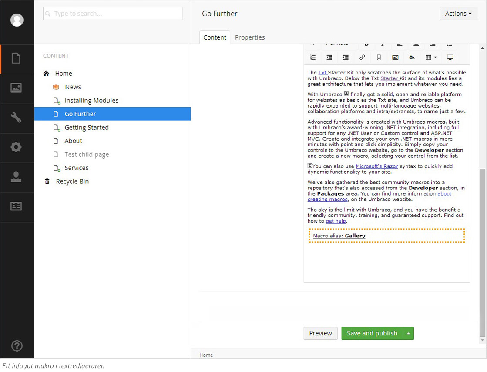

**Redigera makron**

Du kan redigera värden som du lagt in i ett makro efter att det infogats i textredigeraren.

1. Markera makrot i textredigeraren.
2. Klicka på **Makro** i verktygsfältet.
3. I menyn som fälls ut kan du redigera de ifyllda uppgifterna.

**Ta bort makron**

För att ta bort ett makro, markera makrot i textredigeraren och klicka sedan på delete eller backspace tangenten på ditt tangentbord.

####1.9 Tabeller####
Tabeller används för att formatera information i en struktur med kolumner och rader. När du infogar en tabell väljer du hur många rader och kolumner tabellen ska bestå av. Dessa värden kan ändras i efterhand så det är inte viktigt att på förhand veta vilka inställningar som behövs.

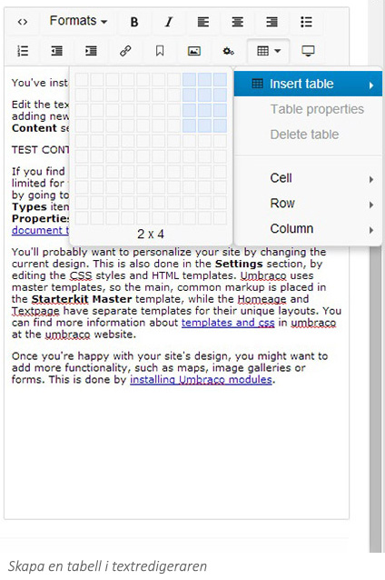

**Redigera en befintlig tabell**

För att redigera tabellen efter att du har skapat den, behöver du klicka på den så att du får en liten fyrkantig ruta i vart och ett av de fyra hörnen (se bild nedan). Därefter klickar du på knappen **Table** (Tabell) i verktygsfältet och väljer **Table properties** (Tabellegenskaper) för att öppna fönstret med inställningar. 

I rutan för tabellegenskaper kan du göra olika inställningar för att modifiera tabellens utseende.  Det kan också vara så att webbutvecklaren har lagt in färdiga stilar för hur tabellen ska se ut, så det kan vara lite olika exakt vad du kan göra på din webbplats. Det finns också fler inställningar att göra - höjd, bredd, justering, sammanfoga, infoga och radera - på både celler, rader och kolumner.

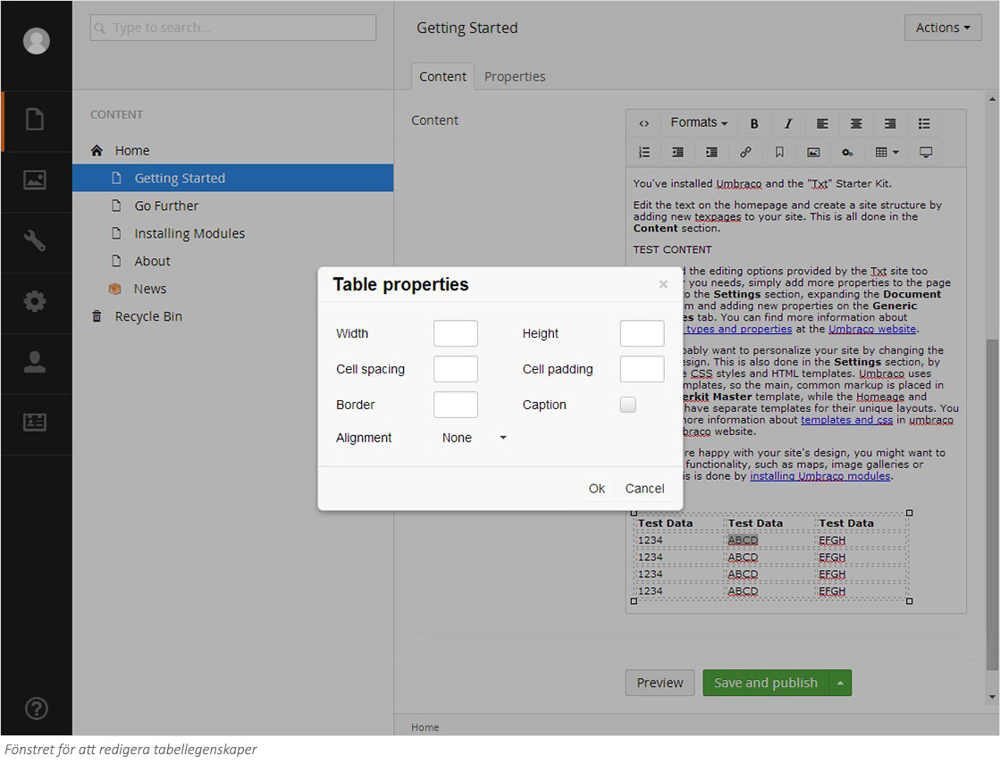