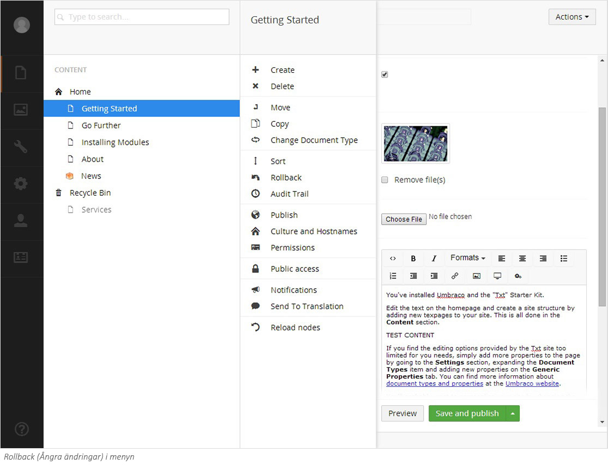
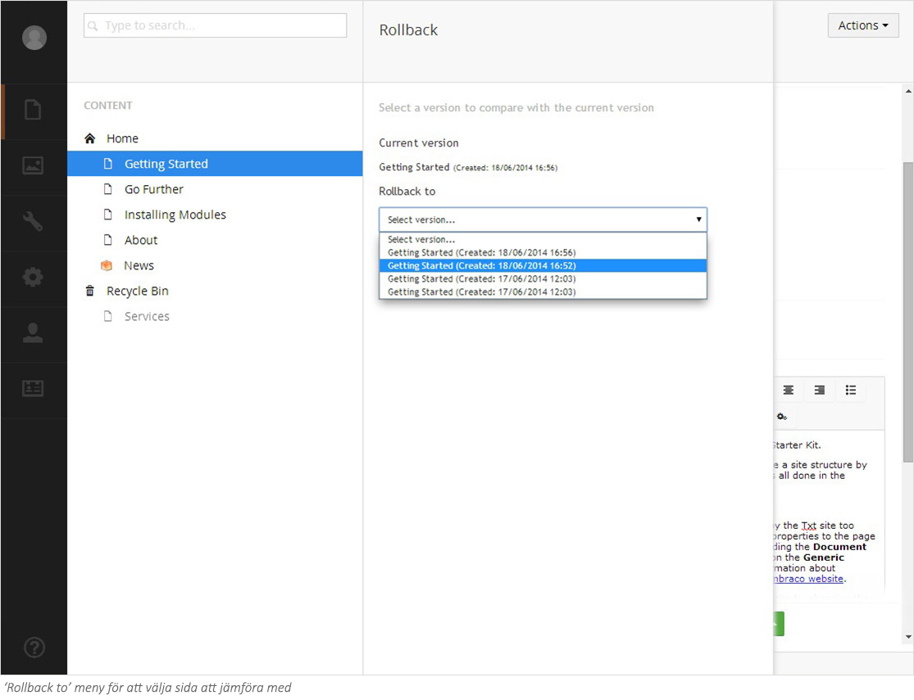
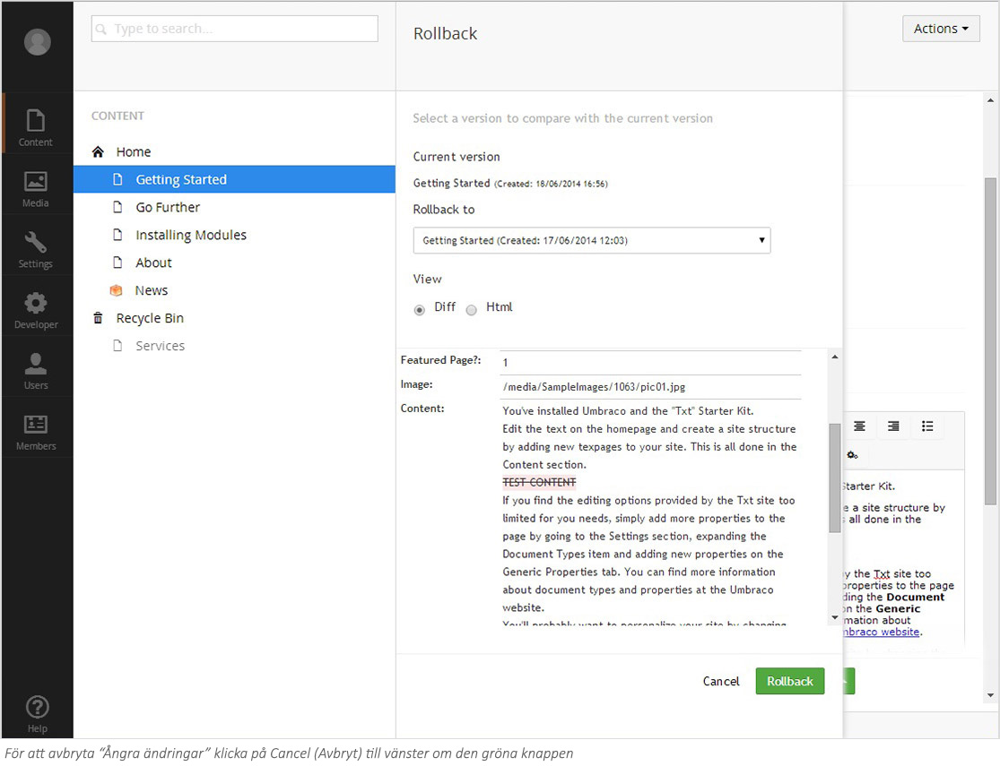

###1. Jämföra versioner###

Umbraco gör det möjligt för dig att arbeta med flera versioner av samma sida. Alla tidigare sparade versioner av en sida sparas i versionshanteraren. Det här betyder att du behöver inte vara orolig för att förlora innehållet på en sida eftersom alla gamla versioner sparas i en historik. Du kan när som helst ta fram en gammal sidversion och publicera den om det skulle behövas. 

####1.1 Jämföra versioner####
För att jämföra en sida med tidigare versioner: 
1. Högerklicka på sidans titel i menyn eller klicka på knappen **Actions** (Händelser).
2. Välj **Rollback** (Ångra ändringar) från menyn.
3. I dialogrutan för att hantera versioner, välj en version från listan **Rollback to**.
4. När du väljer en version från listan får du en jämförelse mellan den aktuella sidan och den valda sidan. Röd, understruken text är text som inte finns med den in den valda versionen och grön text betyder att den kommer att läggas till, om du väljer att rulla tillbaka till den versionen av sidan
5. Om du klickar i knappen **HTML** kommer du att se den valda versionen som HTML. Klickar du i **Diff** kommer du att se skillnaderna mellan versionerna i en lista.

