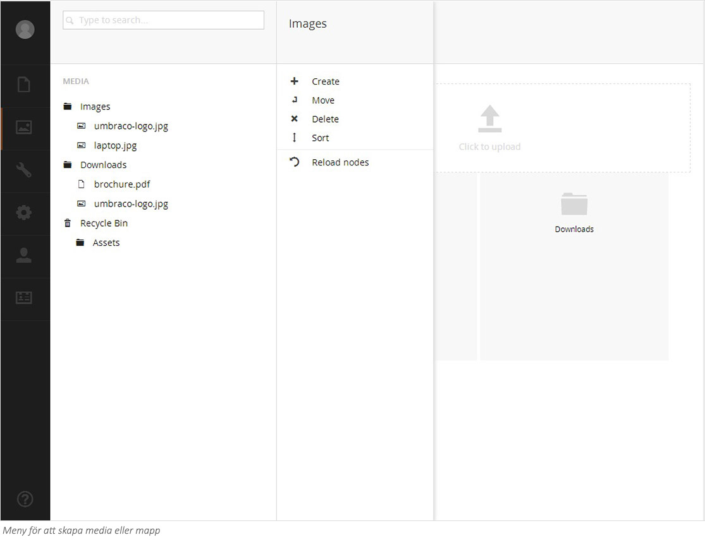
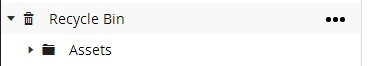
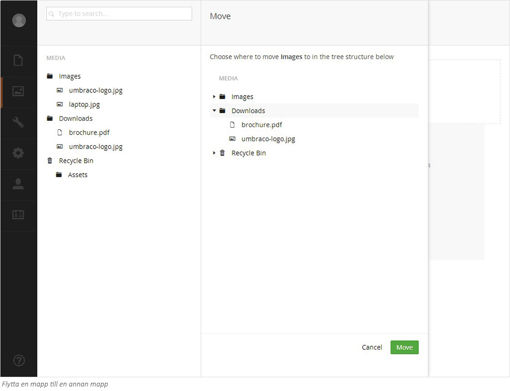

All media på din webbplats måste laddas upp i sektionen Media. Mediasektionen är egentligen ett mediabibliotek för webbplatsen. I Media kan du skapa mappar och hantera filer på liknande sätt som du gör i filsystemet på din dator. 
###1. Arbeta med mappar ###

Mappar används för att organisera mediabiblioteket och skapa en logisk struktur för dina bilder och filer. Det rekommenderas att du använder mappar för att organisera innehållet. När ditt mediabibliotek växer är det en stor hjälp att ha innehållet strukturerat i mappar för att enkelt kunna hitta det du söker.

**Skapa en mapp **
1. Välj den mapp som din nya mapp ska bli en undermapp till. Om du vill skapa en mapp på rotnivå ställer du dig på rubriken Media.
2. Klicka på ikonen **(•••)** och välj att skapa **Folder** (Mapp) från menyn som fälls ut.
3. Fyll i ett namn på mappen och klicka på **Save** (Spara) för att skapa mappen. 

Mappar används bara för att sortera och strukturera i mediabiblioteket. De kommer inte att vara en del av sökvägen till bilderna eller filerna och inga mappar med samma namn skapas heller på webbservern.

**Redigera en mapp**

Om du vill redigera en befintlig mapp gör så här:
1. Klicka på den mapp du vill redigera i mediaträdet.
2. Klicka på titeln högst upp på sidan för att ändra namnet.
3. Klicka på **Save** (Spara) för att genomföra ändringen.

**Radera en mapp**

Om du vill snygga till och rensa i Media kan du enkelt radera befintliga mappar. När du raderar en mapp hamnar den i papperskorgen. Om du ångrar dig kan du återställa den raderade mappen från papperskorgen. 

1. Välj den mapp du vill radera. 
2. Högerklicka på mappen och klicka på **Delete** (Radera) från menyn. 
3. Klicka **OK** för att bekräfta borttagning, eller klicka **Cancel** (Avbryt) för att avbryta raderingen. 

Observera att allt eventuellt innehåll i mappen också tas bort och hamnar i papperskorgen. Du kan återställa mappar och filer från papperskorgen på samma sätt som du kan återställa borttagna sidor.

**Återställa en mapp från papperskorgen**

Papperskorgen är en separat trädstruktur i Mediamenyn och du känner lätt igen den på den lilla symbolen av en papperskorg till vänster. Om du klickar på triangeln framför papperskorgen blir innehållet synligt. För att återställa en mapp, flytta mappen till det ställe i trädstrukturen där du vill att mappen ska hamna. Läs mer om hur du går tillväga under stycket **Flytta en mapp.**

**Flytta en mapp **

Du kan enkelt flytta mappar inom Mediabiblioteket genom att använda funktionen **Move** (Flytta).

1. Välj den mapp som du vill flytta. 
2. Högerklicka på mappen och klicka på **Move** (Flytta) från menyn. 
3. Välj önskad mapp som du vill att din mapp ska ligga under. 

**Sortera innehållet i en mapp**

Innehåll i mediabiblioteket sorteras enligt en förutbestämd sorteringsordning. Vanligtvis innebär det att nya objekt hamnar underst i trädet. Du kan enkelt ändra sorteringsordning i en mapp genom att använda sorteringsfunktionen. 

1. Välj den mapp du vill sortera. 
2. Högerklicka på mappen, och välj **Sort** (Sortera) från menyn. 
3. Dra mappar, bilder och filer i önskad ordning. Alternativt klicka på kolumnrubrikerna Namn eller Datum för att automatiskt sortera efter Namn eller Datum. Klickar du på kolumnrubriken igen blir det omvänd sorteringsordning. 
4. Klicka på **Save** (Spara).