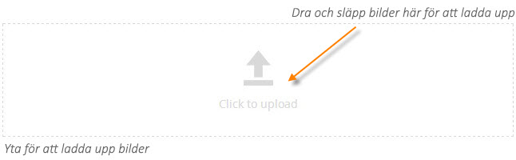
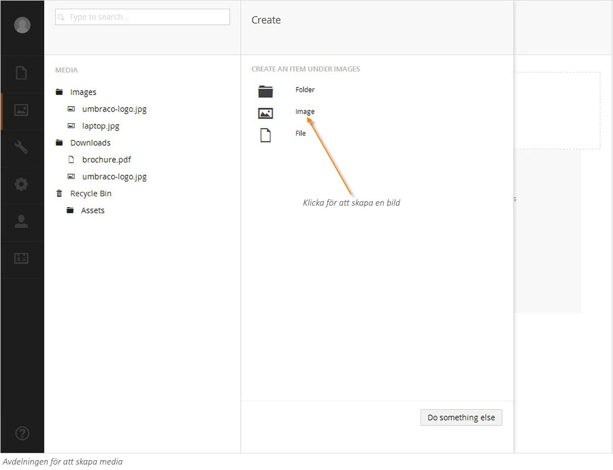
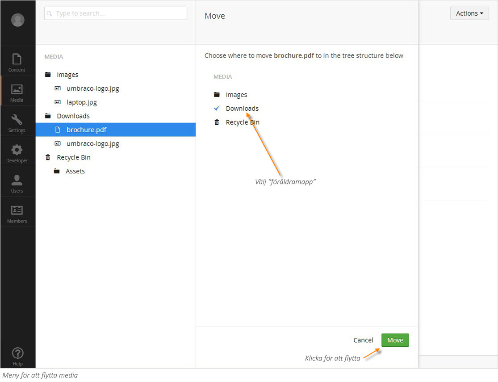

###2. Arbeta med bilder och filer###

**Ladda upp en bild eller fil**

1. Välj den mapp där du vill att din nya bild eller fil ska hamna. Stegen nedan beskriver hur du laddar upp en bild men du gör på motsvarande sätt för att ladda upp filer.
2. Högerklicka på mappen eller på knappen **Actions** (Händelser) högst upp i högra hörnet. Klicka på **Create** (Skapa) från menyn och välj **Bild**. Alternativt kan du välja den stora knappen **Click to upload** (Klicka för att ladda upp) som ligger ovanför mappinnehållet. Du kan också dra filer direkt från din dator och släppa dem på uppladdningsytan.
3. Välj bilden.
4. Klicka på den uppladdade bilden för att se egenskaper och ändra namn.

**Radera en bild eller fil**

Om du vill städa upp och rensa i ditt mediabibliotek kan du enkelt radera innehåll från media. När du raderar en bild hamnar den i papperskorgen. Om du ångrar dig kan du återställa den raderade bilden från papperskorgen. 

1. Välj den bild (fil) du vill radera. 
2. Högerklicka på bilden (filen) och välj **Delete** (Radera) från menyn. 
3. Klicka **OK** för att bekräfta borttagningen, eller klicka **Cancel** (Avbryt) för att avbryta borttagningen.

**Återställa en bild eller fil från papperskorgen**

Papperskorgen är en separat trädstruktur i Mediamenyn och du känner lätt igen den på den lilla symbolen av en papperskorg till vänster. Om du klickar på triangeln framför papperskorgen blir innehållet synligt. För att återställa en bild eller fil, flytta objektet till det ställe i trädstrukturen där du vill att mappen ska hamna. 

**Flytta en bild eller fil**

Du kan enkelt flytta bilder och filer mellan mappar i Mediabiblioteket genom att använda funktionen **Move** (Flytta).

1. Välj den bild/fil som du vill flytta. 
2. Högerklicka på bilden/filen och klicka på **Move** (Flytta) från menyn. 
3. Välj den mapp dit du vill flytta bilden/filen
4. Klicka på **Move** (Flytta).

