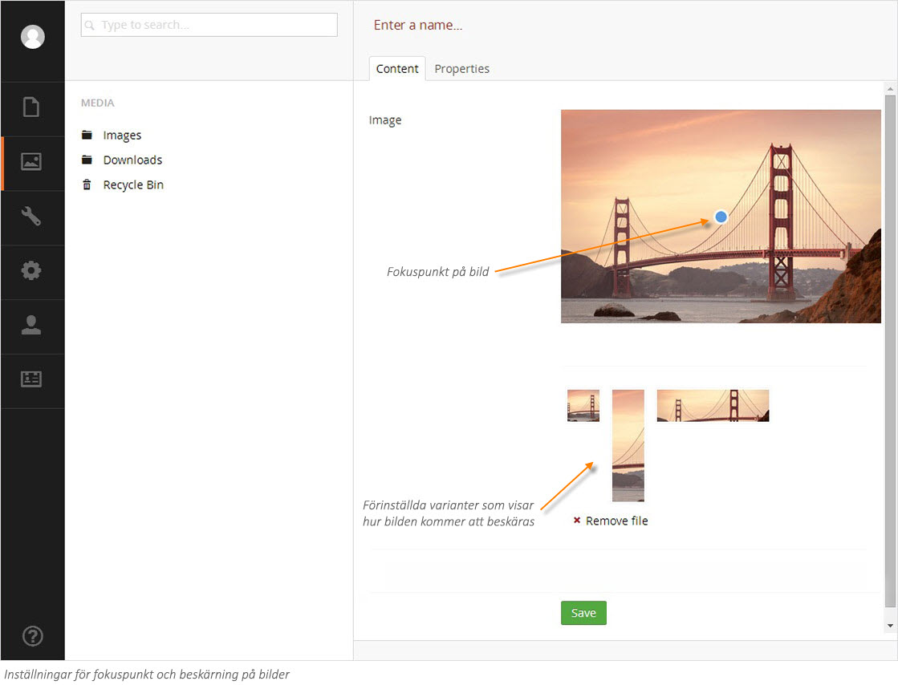
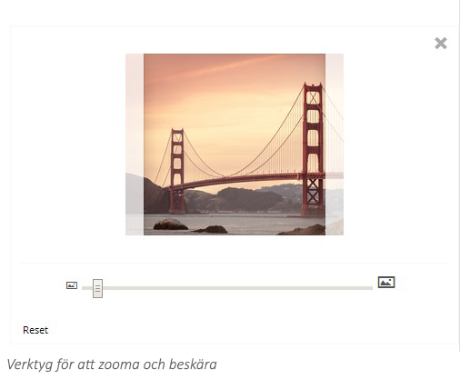

###3. Beskära bilder###

Om din systemadministratör har lagt in möjligheter att beskära bilder kommer det att se ut ungefär som på bilden nedan när du klickar på en bild i mediabiblioteket. Den blå cirkeln mitt på bilden är bildens fokuspunkt. Fokuspunkten definierar var mitten på bilden är när den skalas om eller beskärs. Du kan flytta fokuspunkten genom att klicka och dra den till önskat ställe på bilden. Under bilden ser du olika varianter på bilden, beroende på vilka inställningar din webbplats har. I exemplet nedan finns det tre olika varianter för beskärning.

Om du inte är nöjd med någon av beskärningarna under bilden kan du manuellt ändra. När du klickar på en av varianterna får du upp en förstorad bild av beskärningen där du kan flytta runt bilden och zooma in eller ut tills du blir nöjd. Om du vill återställa till grundvarianten klicka på **Reset** (Återställ) under bilden. När du är nöjd klickar du **X** högst upp till höger för att stänga editorn. Du kan sedan fortsätta med att redigera de andra varianterna på samma sätt. När du är klar klickar du på **Save** (Spara).

