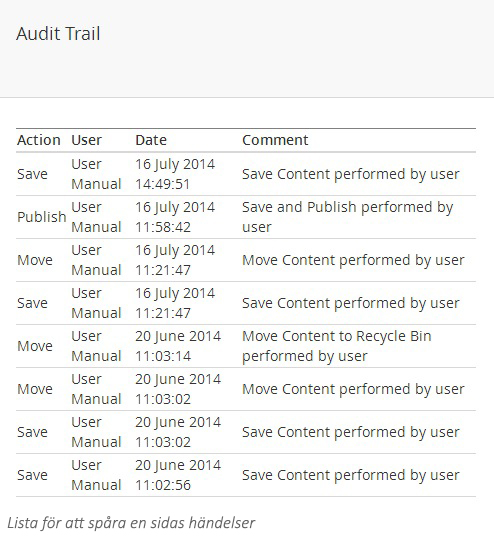

###2. Spåra ändringar###

När du fäller ut menyn på en sida så finns ett val som heter **Audit Trail** (Spåra ändringar) där du får en snabb överblick av vilka händelser som utförts på den noden, av vem och när. Det här kan vara användbart för att få veta vem som gjorde förändringar och när det hände.

