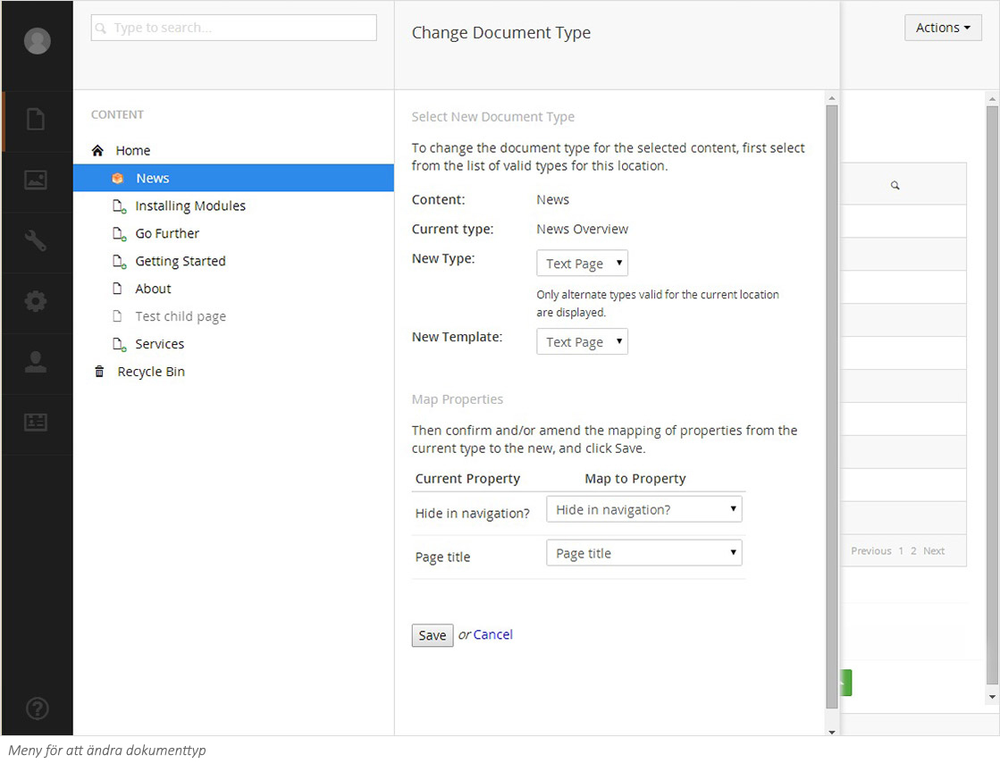

###3. Ändra dokumenttyp###

Med Umbraco 7 finns möjligheten att ändra dokumenttyp på en nod, vilket kan vara användbart om du till exempel har en standardsida som du enkelt vill göra om till en nyhetssida som har annan layout eller inställningar. Bereonde på vilka inställningar din webbplats har och vilka åtgärder du har möjlighet att göra, kanske inte alla dokumenttyper går att konvertera. Kontakta din systemadministratör.

Högerklicka på en sida och välj **Change Document Type** (Ändra dokumenttyp) i menyn och en ny meny fälls ut. På denna meny finns alternativ för att välja ny typ eller ny mall. 

Det är viktigt att notera att när den nya dokumenttypen inte har samma inställningar som den existerande, så det finns en risk att du förlorar data.

