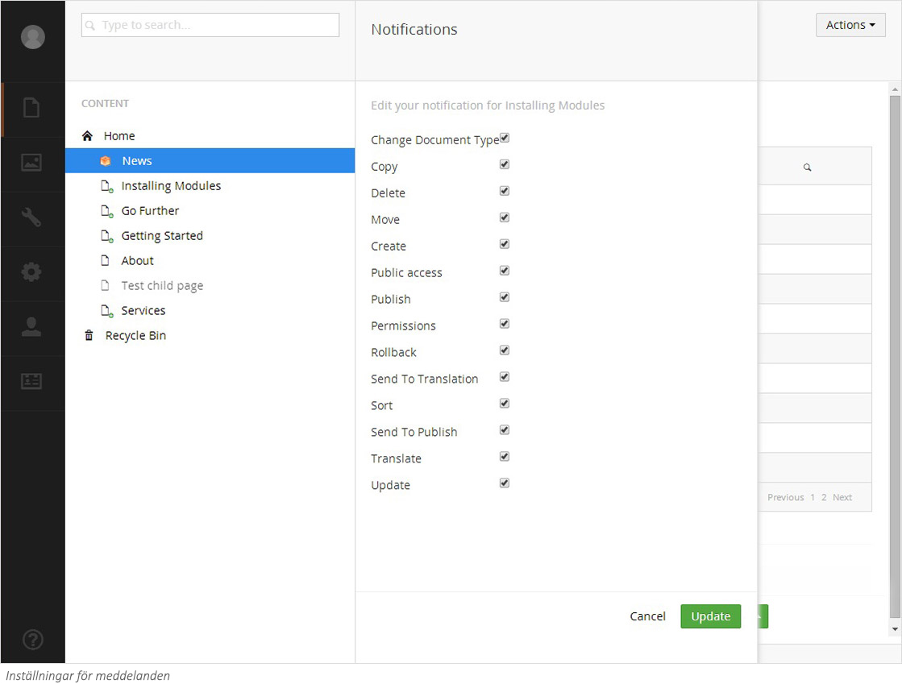

###4. Meddelanden###

Du kan ställa in notifikationer på delar av webbplatsen för att få ett mail när en händelse utförs på utpekade platser.

1. Högerklicka på den sida du vill få meddelanden om.
2. Välj **Notifications** (Meddelanden) från menyn.
3. Bocka i de alternativ du är intresserad av att få meddelanden om  - t.ex. om du vill få meddelande varje gång någon publicerar.

*OBS: Inställningen för meddelanden gäller för den valda sidan samt alla eventuella undersidor i strukturen.*

